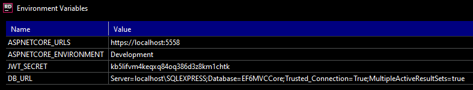
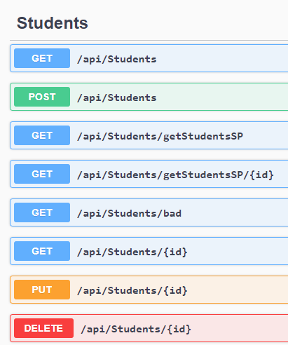
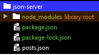
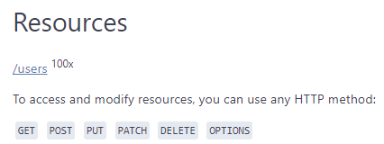

# MVC Core project:

## CRUD application with SQL Server - using Entity Framework6

### SQL Server database:
- connection string in appsettings.json:
 ```c#
      "ConnectionStrings": {
        "DefaultConnection": "Server=localhost\\SQLEXPRESS;Database=EF6MVCCore;Trusted_Connection=True;MultipleActiveResultSets=true"
      }
 ```     

### Environment variables:

It is better to move secrets to environment variables. This is done via Properties/launchSettings.json:
```json
    "MVCCore": {
      "commandName": "Project",
      "launchBrowser": true,
      "environmentVariables": {
        "ASPNETCORE_ENVIRONMENT": "Development",
        "JWT_SECRET": "kb5lifvm4keqxq84oq386d3z8km1chtk",
        "DB_URL": "Server=localhost\\SQLEXPRESS;Database=EF6MVCCore;Trusted_Connection=True;MultipleActiveResultSets=true"
      },
      "applicationUrl": "https://localhost:5558"
    }
```

We can see the Environment variables for the project:




### Scaffolding - generating the mapping classes from existing database
For generating model classes from the existing database we can use scaffolding:
Run something like this in your Package Manager Console in Visual Studio:


    Scaffold-DbContext "Data Source=localhost\SQLEXPRESS;Initial Catalog=SchoolContext6;Integrated Security=True;Connect Timeout=30;Encrypt=False;TrustServerCertificate=False;ApplicationIntent=ReadWrite;MultiSubnetFailover=False" Microsoft.EntityFrameworkCore.SqlServer -OutputDir Models2

- We need to specify:
    - data source
    - database (initial catalog)
    - output directory

### Database Mapping
- Models mapping tables
```c#
    [Table("Student")]
    public class Student
    {
        public int ID { get; set; }
        public string LastName { get; set; }
        public string FirstMidName { get; set; }
        public DateTime EnrollmentDate { get; set; }

        public virtual ICollection<Enrollment> Enrollments { get; set; }
    }
```

- DbContext defining the schema - DbSets:
```c#
    public class SchoolContext : DbContext
    {
        public DbSet<Student> Students { get; set; }
        public DbSet<Enrollment> Enrollments { get; set; }
        public DbSet<Course> Courses { get; set; }
    }
```

### Migration

- Creating the initial schema structure - in case there is no database:
```c#
    public partial class Initial : DbMigration
    {
        public override void Up()
        {
            CreateTable(
                "dbo.Course",
                c => new
                {
                    CourseID = c.Int(nullable: false),
                    Title = c.String(),
                    Credits = c.Int(nullable: false),
                })
                .PrimaryKey(t => t.CourseID);
//... creation of the other tables
```

### Rest Controllers - returning data as json object

- Rest Controllers are using the service layer
```c#
    [Route("api/[controller]")]
    [ApiController]
    public class CoursesController : ControllerBase
    {
        private readonly CoursesService _coursesService;

        public CoursesController(CoursesService coursesService)
        {
            _coursesService = coursesService;
        }

        // GET: api/TodoItems
        [HttpGet]
        public async Task<ActionResult<IEnumerable<Course>>> GetCourses()
        {
            return await _coursesService.GetCourses();
        }
    }
```

- Service layer works with the DbContext

```c#
    public class CoursesService
    {
        private readonly SchoolContext _context;
        
        public CoursesService(SchoolContext context)
        {
            _context = context;
        }
        
        public async Task<ActionResult<IEnumerable<Course>>> GetCourses()
        {
            return await _context.Courses.ToListAsync();
        }
    }
```

### JsonIgnore
- We can use JsonIgnore to avoid infinite loops when we have a mapping classes containing another mapping classes:
    - Example: Student class contains Enrollments and Enrollment contains Student - potential loop...
```c#
    public class Enrollment
    {
        public int EnrollmentID { get; set; }
        public int CourseID { get; set; }
        public int StudentID { get; set; }
        public Grade? Grade { get; set; }
        
        [JsonIgnore]
        public virtual Course Course { get; set; }
        [JsonIgnore]
        public virtual Student Student { get; set; }
    }
```

### Startup

- Configure services - like services for REST Controllers, and Swagger API documentation
```c#
        public void ConfigureServices(IServiceCollection services)
        {
            services.AddScoped<SchoolContext>(_ => 
                new SchoolContext(Environment.GetEnvironmentVariable("DB_URL")));
            services.AddControllers();
            services.AddControllersWithViews();
            services.AddScoped<CoursesService>();
        }
```

- Enable Swagger API documentation
```c#
        public void Configure(IApplicationBuilder app, IWebHostEnvironment env)
        {
        // some more code...

            // Enable middleware to serve generated Swagger as a JSON endpoint.
            app.UseSwagger();

            // Enable middleware to serve swagger-ui (HTML, JS, CSS, etc.),
            // specifying the Swagger JSON endpoint.
            app.UseSwaggerUI(c =>
            {
                c.SwaggerEndpoint("/swagger/v1/swagger.json", "My API V1");
            });
        }
```

### Swagger (API documentation)
- Swagger json endpoint: <localhost:5558/swagger/v1/swagger.json>
- Swagger UI: <localhost:5558/swagger>



### Stored procedures - executing from the application

- Service layer:
    - Executing stored procedure getAllStudentsSp:

```c#
        public async Task<ActionResult<IEnumerable<Object>>> GetStudentsSP()
        {
            var data = _context.Database.SqlQuery<Student>("getAllStudentsSP");
            return await data.ToListAsync();
        }
```

- Rest Controller:
```c#
        [HttpGet]
        [Route("getStudentsSP")]
        public async Task<ActionResult<IEnumerable<Object>>> GetStudentsSP()
        {
            return await _studentsService.GetStudentsSP();
        }
```

- Stored procedure with parameter:
```c#
        public async Task<ActionResult<IEnumerable<Object>>> GetStudentsByIdSP(int id)
        {
            var data = _context.Database.SqlQuery<Student>("exec sp_getStudentById @id", new SqlParameter("id", id));
            return await data.ToListAsync();
        }
```

- Stored procedure for inserting a record
    - procedure looks like this:
```sql
CREATE PROCEDURE sp_createStudent(
	@LastName AS VARCHAR(50),
	@FirstMidName AS VARCHAR(50),
	@EnrollmentDate AS DATE
	)
AS
BEGIN
	INSERT INTO Student values(@LastName, @FirstMidName, @EnrollmentDate)
END;
go
```
- service layer:
```c#
        public void GreateStudentSP(String LastName, String FirstMidName, DateTime EnrollmentDate)
        {
            _context.Database.ExecuteSqlCommand(
                "exec sp_createStudent @LastName, @FirstMidName,@EnrollmentDate", 
                    new SqlParameter("LastName", LastName),
                    new SqlParameter("FirstMidName", FirstMidName),
                    new SqlParameter("EnrollmentDate", EnrollmentDate)
                );
        }
```
- rest controller:
```c#
        // POST: api/Students/createStudentSP
        [HttpPost]
        [Route("createStudentSP")]
        public void CreateStudentSP(String LastName, String FirstMidName, DateTime EnrollmentDate)
        {
            //Student student = new Student(LastName, FirstMidName, EnrollmentDate);
            _studentsService.GreateStudentSP(LastName, FirstMidName, EnrollmentDate);
        }
```

### MVC architecture ... controllers returning the view - http web page
```c#
        // GET: Students
        public async Task<IActionResult> Index()
        {
            return View(await _context.Students.ToListAsync());
        }
```

### Security

- After login, user acquires a JWT - JSON Web Token.
- The token can be used to access endpoints which require it.
```c#
        [HttpPost]
        [Route("login")]
        public async Task<IActionResult> login(string username, string password)
        {
            var userDetails =  await _authService.Login(username, password);
            if (userDetails == null)
            {
                //ModelState.AddModelError("Password", "Invalid login attempt.");
                return StatusCode(StatusCodes.Status400BadRequest, new { message = "error occurred, incorrect user name or password" });
            }
            //HttpContext.Session.SetString("userId", customerDetails.Firstname);
            return Ok(new AuthSuccessResponse { 
                Token = userDetails.Token
            });
        }
```

Data encryption:
```c#
        public static string EncryptData(string text)
        {
            var byteArray = Encoding.UTF32.GetBytes(text);// UTF8.GetBytes(text);
            return Convert.ToBase64String(byteArray);
        }
```

Compare the credentials - we encrypt provided password and compare with the one in the database:
```c#
        public async Task<AuthenticationResult> Login(string username, string password)
        {
            var encPassword = Utils.Encryptdata(password);
            //var decPassword = Utils.Decryptdata(encPassword);
            User user =  _context.Users.SingleOrDefault(m => m.UserName == username && m.Password == encPassword);
            if (user == null)
            {
                return null;
            }
            return GenerateToken(user);
        }
```

Generate JWT:
```c#
        private AuthenticationResult GenerateToken(User user)
        {
            var tokenHandler = new JwtSecurityTokenHandler();
            var key = Encoding.ASCII.GetBytes(_jwtSecret);
            var tokenDescriptor = new SecurityTokenDescriptor
            {
                Subject = new ClaimsIdentity(new[]
                {
                    new Claim(JwtRegisteredClaimNames.Sub, value: user.Id.ToString()),
                    new Claim(JwtRegisteredClaimNames.Jti, value: Guid.NewGuid().ToString()),
                    new Claim(JwtRegisteredClaimNames.Email, value: user.Email)
                }),
                Expires = DateTime.UtcNow.AddHours(2),
                SigningCredentials = new SigningCredentials(new SymmetricSecurityKey(key), SecurityAlgorithms.HmacSha256Signature)
            };

            var token = tokenHandler.CreateToken(tokenDescriptor);
            return new AuthenticationResult
            {
                Success = true,
                Token = tokenHandler.WriteToken(token)
            };
        }
```

HttpRequest for login:
```
POST https://{{host}}/api/Auth/login?username=pesekt&password=123456

> 
```

### Entity Framework Power Tools

[EF Power Tools](https://marketplace.visualstudio.com/items?itemName=ErikEJ.EntityFramework6PowerToolsCommunityEdition)


### Json-server
- [json-server npm](https://www.npmjs.com/package/json-server)


- Fake REST API generated from a json file.
- Install json-server (npm install json-server) ... this will install the dependencies in node_modules
- package.json:
```json
      "scripts": {
        "start": "json-server --watch ./posts.json"
      },
```     

- Run json-server: **npm start**: <http://localhost:3000/posts>
- Or run: **npx json-server data.json**
- Generate data for json-server: (Install packages faker and lodash)
```bash
    npm install faker lodash
```
- [npm faker](https://www.npmjs.com/package/faker)
- [npm lodash](https://www.npmjs.com/package/lodash)

- Create js function generate.js:
```javascript
    module.exports = function () {
        let faker = require("faker");
        let _ = require("lodash");
    
        return {
            users: _.times(100, function(n){
                return{
                    id: n,
                    name: faker.name.findName(),
                    avatar: faker.internet.avatar()
                }
            })
        }
    }    
```
- run json-server with this function:
```bash
    npx json-server generate.js
```

- Now we have an API people with 100 json objects which were generated by that function.


- We have all the CRUD features. If we POST new data, we can save it by executing "s" command. 
It will create a snapshot json file.

[json-server github](https://github.com/typicode/json-server)

- There are many features like sorting, pagination, etc.:

    <http://localhost:3000/users?_sort=first_name&_order=desc>

- Add custom routes:
    - Create routes.json
```json
        {
          "/resources/:year": "/resources?year=:year"
        }
```

Run the server with routes: **npx json-server data.json --routes routes.json**

Now We have an extra route: <http://localhost:3000/resources/2005>

- We can also deploy our json-server app on Heroku, Azure etc. and have our public fake api running.


## CRUD application with MongoDB

### Dependencies

- Visit the [NuGet Gallery: MongoDB.Driver](https://www.nuget.org/packages/MongoDB.Driver/) to determine the latest stable version of the .NET driver for MongoDB. In the **Package Manager Console** window, navigate to the project root. Run the following command to install the .NET driver for MongoDB:

    ```powershell
    Install-Package MongoDB.Driver -Version {VERSION}
    ```

- Install-Package Newtonsoft.Json

    ```powershell
    Install-Package Newtonsoft.Json
    ```

- Code structure:

- MVCCore
    - MongoDB
        - Controllers
        - Models
        - Services
    
register services in the startup.cs:

```c#
        public void ConfigureServices(IServiceCollection services)
        {
            ...
            //MongoDB CRUD app services:
            services.AddScoped<IMongoClient>(s => 
                new MongoClient(Environment.GetEnvironmentVariable("MONGO_URL"))
            );
            services.AddScoped<BookService>();
            
            services.AddControllers()
                .AddNewtonsoftJson(options => options.UseMemberCasing()); //for MongoDB
```

Set up the environment variables in Properties/launchSettings.json:
```josn
    "MVCCore": {
      "environmentVariables": {
        "MONGO_URL": "mongodb://localhost:27017",
        "MONGO_DB": "BookstoreDb"
      },
```